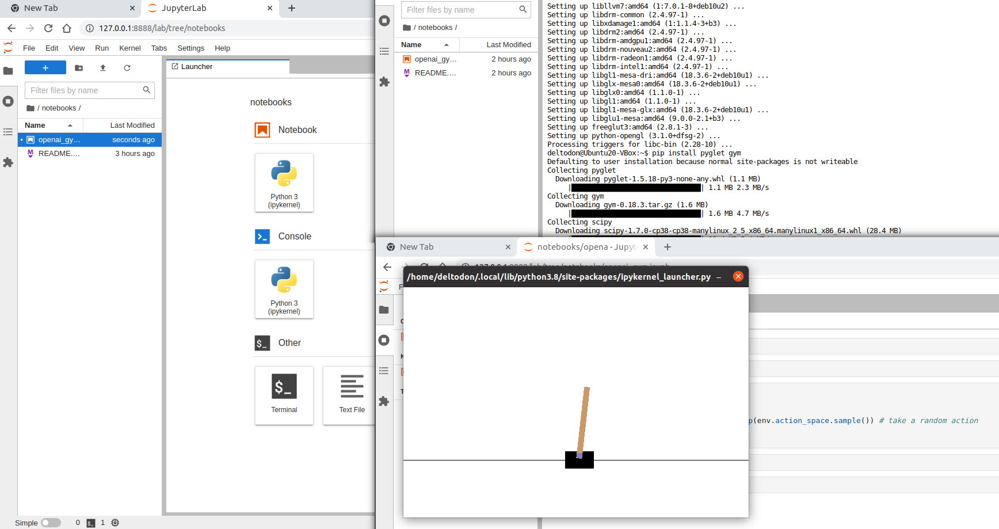

# OpenAI Gym example

running from jupyterlab in docker container


### Requirements

Open the terminal from inside of the jupyter lab and install these packages

```
sudo apt-get install python-opengl
pip install pyglet gym
```

Open and run the **[openai_gym](openai_gymipynb)** notebook. New pop-up window will open with CartPole environment.


